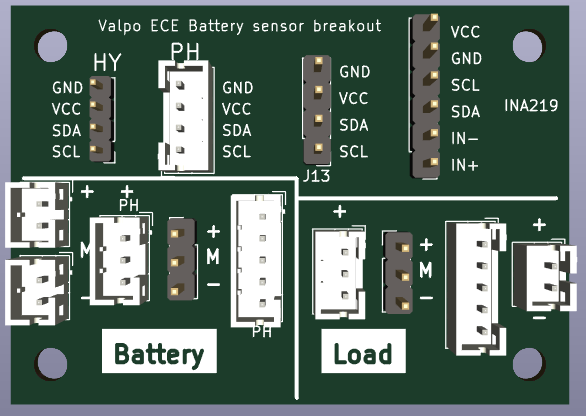

= Power sensor breakout board

Connect common 1S or 2S lithium battery connectors to a load via a INA219 current sensor module.

link::power-sensor-breakout/power-sensor-breakout.pdf[Schematic (PDF)^]

